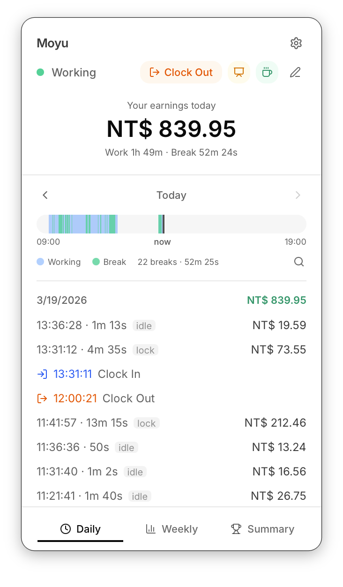
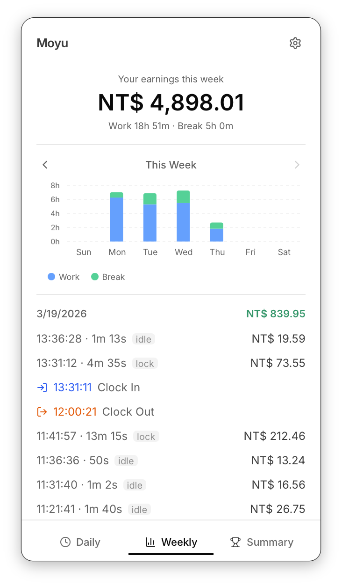

# Moyu — Break Salary Tracker

**Moyu (摸魚)** is a macOS menu bar app that tracks your earnings during breaks at work. Inspired by the Chinese term for "slacking off", it shows the value of your break time in real time. Whether you're taking a quick coffee break or a long lunch, Moyu calculates your break salary based on your configured wage and work schedule.

It floats as a compact panel in your menu bar, automatically detects screen locks and idle time.

## Screenshots

&nbsp;&nbsp;&nbsp;&nbsp;

## First Launch: macOS Quarantine

macOS may block the app on first open since it's not from the App Store. Run this command in terminal to remove the quarantine flag:

```bash
xattr -rd com.apple.quarantine /Applications/Moyu.app
```

## How It Works

1. Enter your salary and work schedule in Settings
2. Click **Clock In** when you start your day
3. Lock your screen or go idle — Moyu detects it and starts a break timer with a live earnings counter
4. Come back — the break is recorded with how much you earned
5. Click **Clock Out** when you're done for the day
6. If you want to pause break detection, click the meeting button

---

## Development

### Prerequisites

- [Node.js](https://nodejs.org/) (v18+)
- [Rust](https://www.rust-lang.org/tools/install)
- [Tauri CLI prerequisites](https://v2.tauri.app/start/prerequisites/)

```bash
yarn install
yarn tauri dev      # run locally
yarn tauri build    # build → src-tauri/target/release/bundle/
```

## Tech Stack

- **Frontend**: React 19, TypeScript, TailwindCSS 4, Zustand
- **Backend**: Rust, Tauri 2
- **macOS Integration**: Core Foundation (screen lock events), Core Graphics (idle detection), NSPanel (floating window)
