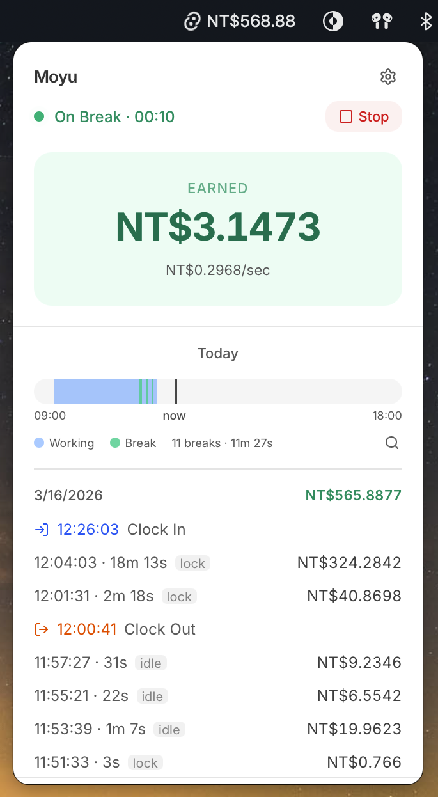
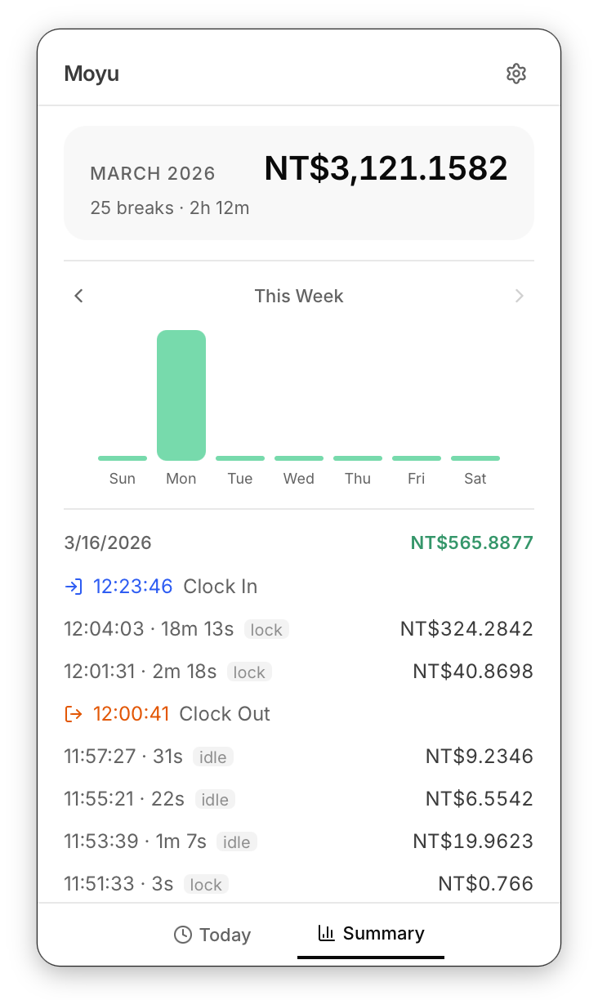
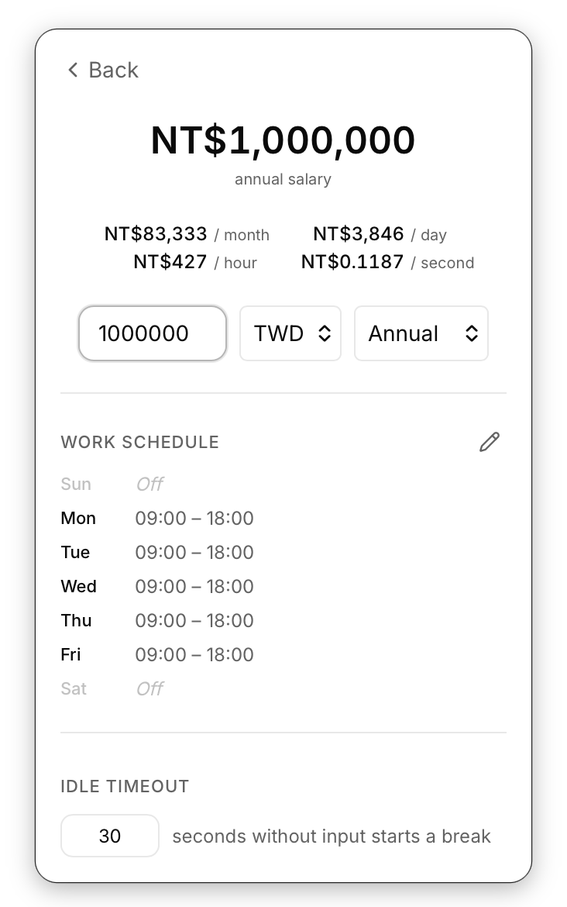

# Moyu — Break Salary Tracker

**Moyu (摸魚)** is a macOS menu bar app that tracks your breaks and shows you exactly how much you've earned while away from your screen — because your time has value, even when you're not working.

It floats as a compact panel in your menu bar, automatically detects screen locks, and ticks up your earnings in real time.

## Screenshots

<table>
  <tr>
    <td></td>
    <td></td>
    <td></td>
  </tr>
</table>

## Features

- **Automatic break detection** — starts and stops timers when you lock/unlock your screen, or when the system detects you've gone idle
- **Real-time earnings ticker** — live per-second counter shown in the panel and in the menu bar title while on break
- **Break reason tagging** — each break is labeled as screen-lock, idle, manual, or custom
- **Daily timeline & weekly summary** — visual charts of your work and break periods; click any day in the weekly view to drill in
- **Flexible salary config** — annual, monthly, or hourly input across 8 currencies, with a live breakdown down to the per-second rate

## How to Use

1. Open Settings and enter your salary and work schedule
2. Click **Clock In** when you start working
3. Lock your screen to take a break — the timer starts automatically
4. Unlock your screen — the break is recorded with your earnings
5. Check the **Today** tab for a daily breakdown, or **Summary** for weekly trends

You can also manually add break or work entries, and right-click any history item to edit or delete it.

## First Launch: macOS Quarantine

macOS may block the app on first open since it's not from the App Store. Run this command to remove the quarantine flag:

```bash
xattr -rd com.apple.quarantine /Applications/Moyu.app
```

Then open the app normally.

---

## Development

### Prerequisites

- [Node.js](https://nodejs.org/) (v18+)
- [Rust](https://www.rust-lang.org/tools/install)
- [Tauri CLI prerequisites](https://v2.tauri.app/start/prerequisites/)

### Run locally

```bash
yarn install
yarn tauri dev
```

### Build

```bash
yarn tauri build
```

The built app will be in `src-tauri/target/release/bundle/`.

## Tech Stack

- **Frontend**: React 19, TypeScript, TailwindCSS 4, Zustand
- **Backend**: Rust, Tauri 2
- **macOS Integration**: Core Foundation (screen lock events), Core Graphics (idle detection), NSPanel (floating window)
